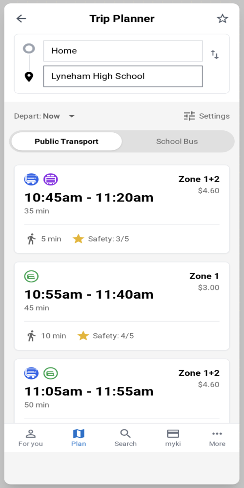
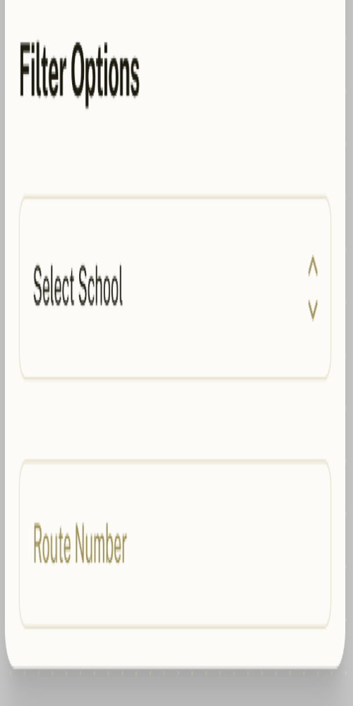
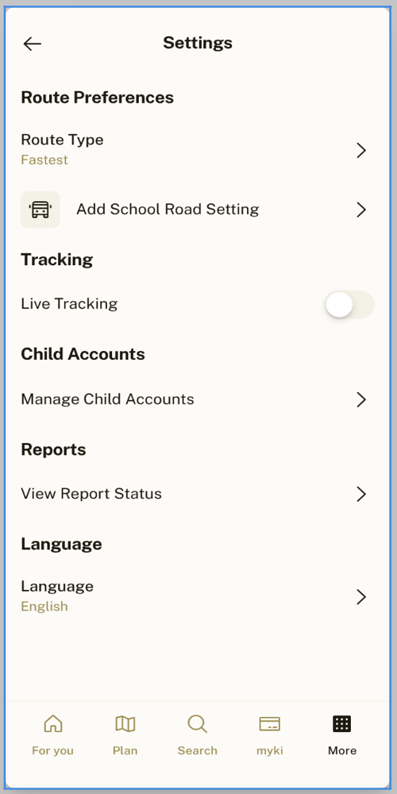

# PTV School Bus – Design Screens
_Last updated: 2025-08-30 12:08_

This folder contains the **School Bus integration** designs for the PTV app.

## Folder Layout
- `mockups/` – PNG exports of each screen (named consistently)
- `README.md` – this document with a quick visual map

---

## Screen Index

### Trip Planner
- **Public transport results**  
  
- **School bus results**  
  
- **School buses list**  
  
- **Filter panel (by school / route)**  
  

### Route Details & Live Tracking
- **Route details (school bus)**  
  
- **Live bus tracking**  
  

### Settings
- **Settings**  
  

### Profile & Reporting
- **My Child profile**  
  
- **Report unsafe stop (form)**  
  
- **Report submitted**  
  

### Onboarding Flow
1. **Welcome**  
   
2. **Select school**  
   
3. **Link Myki or child profile**  
   
4. **Set preferences** (fastest vs safest, live tracking)  
   
5. **Enable notifications**  
   
6. **All set**  
   

---

## Notes
- Image names use a **clear, consistent scheme** so you can search quickly.
- Add new exports into `mockups/` using the same naming style, e.g. `trip_planner_itinerary.png`.

