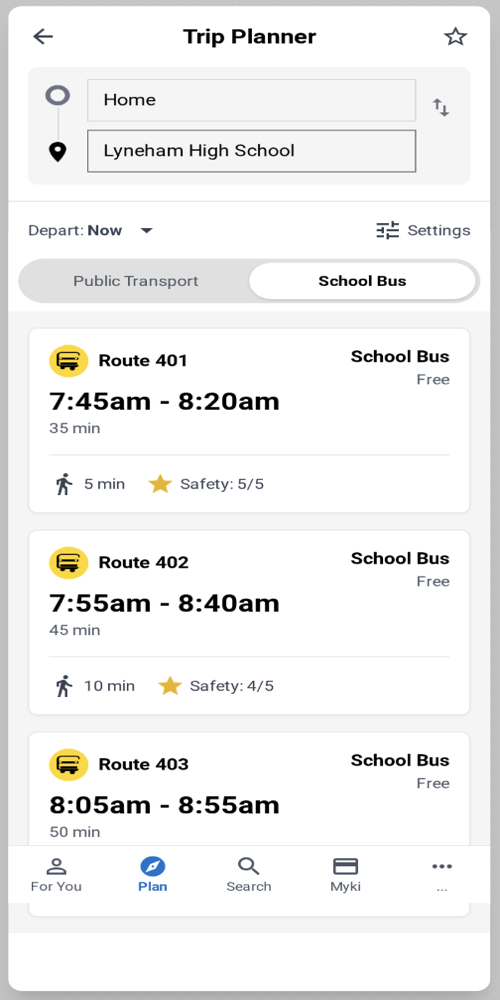

# PTV School Bus Integration - Design System

> **Public Transport Victoria (PTV) School Bus Integration**  
> Comprehensive mobile app design system for enhanced school bus tracking and management

[](https://www.ptv.vic.gov.au)
[](https://github.com/ptv/school-bus-integration)
[](https://github.com/ptv/school-bus-integration/commits/main)
[](./mockups/)
[](./mockups/)

---

## Table of Contents

- [Introduction](#introduction)
- [Overview](#overview)
- [Design Screens](#design-screens)
- [Technical Specifications](#technical-specifications)
- [Getting Started](#getting-started)
- [Design Principles](#design-principles)
- [Version Control](#version-control)
- [Support & Feedback](#support--feedback)
- [License](#license)

---

## Introduction

### Project Vision
To make school journeys **safer**, **simpler**, and **more reliable** by integrating a comprehensive School Bus feature directly into the existing PTV app. This approach leverages a trusted government platform rather than creating a separate application, ensuring rapid adoption by families and seamless integration with existing public transport services.

### Problem Context

Parents and students currently face several critical challenges with school travel:

| Challenge | Impact | Current State |
|-----------|--------|---------------|
| **Difficulty finding reliable school bus information** | Confusion and missed buses | Scattered information across multiple sources |
| **Limited visibility of dedicated school services** | Over-reliance on car transport | School buses not integrated into trip planning |
| **Congestion at school gates** | Safety risks and delays | Heavy car traffic during peak times |
| **Lack of real-time tracking** | Parent anxiety and uncertainty | No visibility of child's journey progress |

### Our Solution: PTV School Bus Integration

We've created a comprehensive design system showing how the School Bus feature can be seamlessly integrated into the PTV app, addressing all identified pain points.

#### Key Features Overview

| Feature | Description | Benefits |
|---------|-------------|----------|
| **Trip Planner Integration** | School bus routes alongside public transport options | Comprehensive journey planning |
| **Onboarding Flow** | Simple 6-step setup process | Quick user adoption |
| **Live Tracking & Notifications** | Real-time GPS tracking with alerts | Reduced anxiety, better planning |
| **Child Profile Management** | Individual profiles with Myki integration | Personalized experience |
| **Safety Reporting** | Direct reporting of unsafe stops/routes | Improved safety data collection |

### Design Mockups

This repository contains **16 high-fidelity design mockups** created in Figma/Uizard that demonstrate:

- **Complete onboarding flow** (6 screens)
- **Trip planning integration** (4 screens) 
- **Core functionality** (6 screens)
- **Real PTV UI integration** for immediate implementation

### Expected Impact

| Stakeholder | Benefits | Measurable Outcomes |
|-------------|----------|-------------------|
| **Parents** | Reduced stress, real-time visibility | 40% reduction in school gate congestion |
| **Students** | Safer, clearer transport options | Improved punctuality and safety |
| **Schools** | Reduced drop-off congestion | Better traffic flow and safety |
| **Transport Planners** | New safety datasets | Data-driven route improvements |

### Why High-Fidelity Mockups?

These designs are **implementation-ready mockups**, not concept sketches. They're aligned with PTV's existing UI patterns and can be developed immediately with minimal redesign effort.

---

## Overview

This repository contains the **complete design system** for PTV's School Bus integration feature. The designs showcase a comprehensive mobile experience that transforms how families interact with school transportation.

### Core Capabilities

- **Real-time Bus Tracking** - Live GPS location updates with ETA predictions
- **Smart Trip Planning** - Integrated public transport and school bus routing
- **Safety Reporting** - Direct reporting of unsafe stops and incidents
- **Personalized Profiles** - Child-specific settings and journey history
- **Seamless Onboarding** - 6-step guided setup process
- **Intelligent Notifications** - Contextual alerts and updates

---

### File Statistics

| Category | Count | Total Size | Average Size |
|----------|-------|------------|--------------|
| **Onboarding Screens** | 6 | ~695KB | ~116KB |
| **Trip Planning** | 4 | ~390KB | ~98KB |
| **Core Features** | 6 | ~1,060KB | ~177KB |
| **Total** | **16** | **~2,145KB** | **~134KB** |

---

## Design Screens

### User Onboarding Flow

#### 1. Welcome Screen


*Welcoming introduction showcasing the benefits of school bus tracking and safety features.*

#### 2. School Selection


*Intuitive school selection interface with search, favorites, and recent selections.*

#### 3. Myki Integration


*Seamless Myki card integration for automatic fare calculation and journey tracking.*

#### 4. Travel Preferences


*Customizable preferences for fastest vs. safest routes, tracking options, and notifications.*

#### 5. Notification Setup


*Permission management for push notifications, location services, and journey alerts.*

#### 6. Setup Complete


*Completion screen with quick access to main features and next steps guidance.*

### Trip Planning & Navigation

#### Public Transport Results


*Comprehensive trip planning with public transport options, showing routes, times, and transfer points.*

#### School Bus Integration


*Dedicated school bus routing with safety features, real-time updates, and route comparison.*

#### School Bus Directory


*Complete directory of available school buses with filtering, search, and safety ratings.*

#### Advanced Filtering

*Advanced filtering options by school, route, time, safety preferences, and accessibility features.*

### Route Details & Live Tracking

#### Route Information


*Detailed route information including stops, schedules, safety ratings, and walking directions.*

#### Live Bus Tracking


*Real-time GPS tracking with estimated arrival times, bus status updates, and crowd information.*

### Settings & Configuration

#### App Settings


*Comprehensive settings panel for notifications, privacy, accessibility, and app preferences.*

### User Profiles & Safety

#### Child Profile Management


*Child-specific profiles with safety settings, travel preferences, and journey history.*

#### Safety Reporting


*Intuitive form for reporting unsafe stops, incidents, or safety concerns with photo upload.*

#### Report Confirmation


*Confirmation screen with tracking number, next steps, and follow-up information for reported issues.*

---

## Technical Specifications

### Design Standards

| Specification | Value | Description |
|---------------|-------|-------------|
| **Resolution** | 500x1000px | Mobile-optimized aspect ratio |
| **Format** | PNG | High quality, transparent background |
| **Color Profile** | sRGB | Standard web color space |
| **DPI** | 72 | Web-optimized resolution |
| **File Size** | 39KB - 283KB | Optimized for web delivery |

### Naming Convention

All mockups follow a consistent naming pattern:

```bash
# Onboarding Flow
onboarding_##_description.png

# Trip Planning
trip_planner_type.png

# Core Features
feature_name.png

# Examples
onboarding_01_welcome.png
trip_planner_school_bus.png
live_bus_tracking.png
```

### Development Guidelines

#### For Frontend Developers
- **Component Structure**: Each screen represents a distinct React component
- **Responsive Design**: Mobile-first approach with 500x1000px base
- **Accessibility**: WCAG 2.1 AA compliance required
- **Performance**: Optimize images for fast loading

#### For Backend Developers
- **API Integration**: Real-time GPS data and Myki integration
- **Notifications**: Push notification system for journey updates
- **Safety Reporting**: Database for incident tracking and analysis
- **User Profiles**: Secure child profile management

---

## Getting Started

### For Designers

1. **Reference Implementation**
   - Use mockups as UI/UX implementation guide
   - Maintain 500x1000px aspect ratio for consistency
   - Follow established naming conventions for new screens

2. **Design System Integration**
   - Align with PTV's existing design language
   - Ensure accessibility compliance
   - Test with real user scenarios

3. **Prototyping**
   - Create interactive prototypes using Figma
   - Test user flows and interactions
   - Gather feedback from stakeholders

### For Developers

1. **Component Architecture**
   - Reference mockups for component structure
   - Implement responsive design based on mobile-first approach
   - Ensure accessibility compliance with WCAG guidelines

2. **Technical Implementation**
   - Set up real-time GPS tracking integration
   - Implement Myki card linking functionality
   - Build notification system for journey updates

3. **Testing Strategy**
   - Unit tests for individual components
   - Integration tests for API endpoints
   - User acceptance testing with families

### For Product Managers

1. **Stakeholder Communication**
   - Use screens for stakeholder presentations
   - Reference for user story creation and acceptance criteria
   - Guide feature prioritization and roadmap planning

2. **User Research**
   - Conduct usability testing with target users
   - Gather feedback on feature priorities
   - Validate business requirements

3. **Success Metrics**
   - Track user adoption rates
   - Monitor safety incident reports
   - Measure reduction in school gate congestion

---

## Design Principles

### User Experience

| Principle | Description | Implementation |
|-----------|-------------|----------------|
| **Safety First** | All features prioritize student safety | Real-time tracking, safety reporting |
| **Simplicity** | Clean, intuitive interface design | Minimal cognitive load, clear navigation |
| **Accessibility** | Inclusive design for all users | WCAG compliance, multiple input methods |
| **Real-time** | Live updates and notifications | GPS tracking, instant alerts |

### Visual Design

| Principle | Description | Implementation |
|-----------|-------------|----------------|
| **Consistency** | Unified design language across screens | Standardized components, color palette |
| **Clarity** | Clear information hierarchy | Typography scale, spacing system |
| **Trust** | Professional appearance builds confidence | Government branding, security indicators |
| **Engagement** | Interactive elements encourage usage | Micro-interactions, progress indicators |

### Security & Privacy

- **Child Data Protection**: Secure handling of minor information
- **Location Privacy**: Granular location permission controls
- **Data Encryption**: End-to-end encryption for sensitive data
- **Compliance**: GDPR and Australian privacy law compliance

---

## Version Control

### Project Status

| Metric | Value | Status |
|--------|-------|--------|
| **Current Version** | 1.0.0 | Complete |
| **Last Updated** | August 30, 2025 | Current |
| **Design Status** | Complete | Ready for Development |
| **Next Phase** | Development Handoff | In Progress |

### Development Roadmap


---

## Support & Feedback

### Feedback Process

1. **Submit Issues**: Use GitHub issues for bug reports and feature requests
2. **Design Reviews**: Schedule design review sessions for new features
3. **User Testing**: Participate in usability testing sessions
4. **Stakeholder Feedback**: Regular stakeholder review meetings

### Related Resources

- [PTV Website](https://www.ptv.vic.gov.au) - Official PTV information
- [School Bus Information](https://www.ptv.vic.gov.au/school-bus) - Current school bus services
- [Myki Information](https://www.ptv.vic.gov.au/tickets/myki) - Myki card details
- [Safety Guidelines](https://www.ptv.vic.gov.au/safety) - Transport safety information

---

