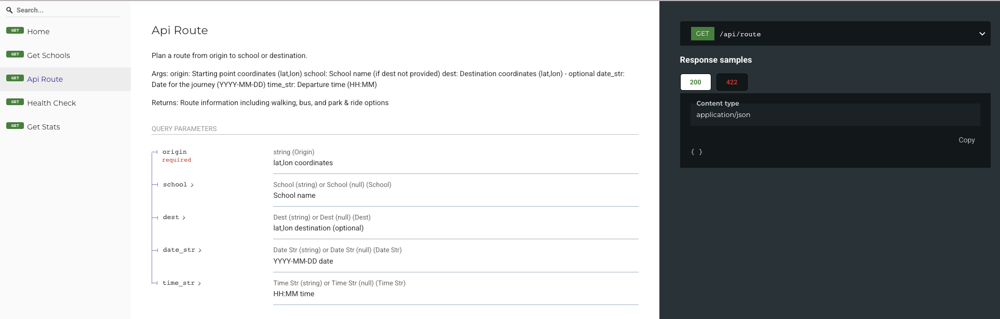
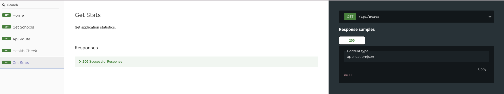

# Trust Track Web Application

A modern, safety-focused web application for planning secure routes to school using public transport, school buses, and walking paths.

## Live Application

**Access the application:** http://localhost:8000

## Overview

Trust Track is a comprehensive web-based school safety routing application designed to help parents and students find the safest routes to school. The application combines real-time public transport data, school bus services, and safety analytics to provide peace of mind for school journeys.

## Key Features

### Safety-First Design
- **Safety Scoring**: Every route is evaluated for safety factors
- **Well-lit Paths**: Prioritizes routes with good lighting
- **Population Density**: Favors populated, well-monitored areas
- **Traffic Patterns**: Considers pedestrian-friendly routes

### Multi-Modal Transport
- **Public Transport**: Integration with Canberra's public transport network
- **School Buses**: Dedicated school bus services and routes
- **Walking Routes**: Safe pedestrian paths with safety overlays
- **Park & Ride**: Convenient parking and transport options

### Modern User Interface
- **Responsive Design**: Works seamlessly on desktop, tablet, and mobile
- **Interactive Maps**: Real-time route visualization with Leaflet.js
- **Intuitive Navigation**: Clean, modern interface with clear icons
- **Real-time Updates**: Live bus tracking and arrival predictions

## Application Screenshots

### Main Application Interface

#### Web Application Overview

*Main Trust Track interface with trip planner and interactive map*

#### Interactive Map

*Real-time map with route visualization and safety overlays*

### Trip Planning Features

#### Start Point Selection

*Choose your starting location with GPS integration*

#### Start Point Alternative View

*Alternative view of start point selection interface*

#### Start Point Walking View

*Start point selection with walking route options*

#### Destination Planning

*Select school destinations with safety scoring*

#### Destination Alternative View

*Alternative view of destination selection*

#### Walking Route Planning

*Safe walking routes with pedestrian-friendly paths*

### User Interface Components

#### Profile Management

*User profile and child safety settings management*

#### Application Settings

*Customize safety preferences and notification settings*

### API Documentation

#### Interactive API Documentation

*Comprehensive API documentation with interactive testing*

#### API Endpoints Overview

*Detailed endpoint documentation and examples*

#### API Testing Interface

*Test API endpoints directly from the documentation*

### Additional API Views

#### API Schema Documentation

*API schema and data structure documentation*

#### API Endpoint Details

*Detailed view of specific API endpoints*

#### API Response Examples

*Example API responses and data formats*

#### Comprehensive API Documentation

*Complete API documentation with all endpoints*

#### API Response Testing

*Interactive API response testing interface*

#### API Schema Overview

*Complete API schema and model documentation*

## How to Use

### Getting Started

1. **Open the Application**
   - Navigate to http://localhost:8000
   - The application will load with the main interface

2. **Plan Your First Route**
   - Enter your starting point (address or use GPS)
   - Select your child's school from the dropdown
   - Choose your preferred departure date and time
   - Click "Plan Route" to see available options

3. **Compare Route Options**
   - **Recommended Route**: Best overall option (safety + time)
   - **Walking Route**: Safe pedestrian path
   - **Fastest Route**: Quickest option (may use busier roads)
   - Each route shows safety score and estimated time

### Using the Interactive Map

- **Toggle Route Types**: Use the map controls to show/hide different routes
- **Zoom and Pan**: Navigate the map to explore your route
- **Safety Overlays**: View safety information and bus stops
- **Real-time Updates**: See live bus locations and arrival times

### Safety Features

- **Safety Scoring**: Every route displays a safety percentage
- **Incident Reporting**: Report safety concerns at any location
- **Live Tracking**: Monitor bus locations in real-time
- **Safety Alerts**: Receive notifications about route changes

### User Settings

- **Profile Management**: Manage your child's safety preferences
- **Notification Settings**: Customize safety alerts and updates
- **Route Preferences**: Set safety vs. speed priorities
- **Transport Preferences**: Choose preferred transport modes

## Technical Features

### Frontend Technologies
- **HTML5/CSS3**: Modern, responsive design
- **JavaScript**: Interactive features and real-time updates
- **Leaflet.js**: Interactive mapping and route visualization
- **Font Awesome**: Professional iconography

### User Experience
- **Mobile-First Design**: Optimized for all device sizes
- **Accessibility**: High contrast, readable fonts, keyboard navigation
- **Performance**: Fast loading times and smooth interactions
- **Intuitive Interface**: Clear navigation and helpful tooltips

### Real-Time Features
- **Live Bus Tracking**: Real-time location updates
- **Dynamic Route Updates**: Automatic re-routing for safety
- **Safety Alerts**: Immediate notifications for incidents
- **Interactive Maps**: Real-time route visualization

## Browser Compatibility

- **Chrome**: Full support (recommended)
- **Firefox**: Full support
- **Safari**: Full support
- **Edge**: Full support
- **Mobile Browsers**: Optimized for iOS Safari and Chrome Mobile

## Troubleshooting

### Common Issues

1. **Map Not Loading**
   - Check your internet connection
   - Refresh the page
   - Clear browser cache

2. **Route Planning Fails**
   - Verify your starting point is valid
   - Check that the school is selected
   - Ensure date and time are set correctly

3. **Slow Performance**
   - Close other browser tabs
   - Check your internet connection
   - Try refreshing the page

### Getting Help

- **API Documentation**: http://localhost:8000/docs
- **Interactive Testing**: http://localhost:8000/redoc
- **Browser Console**: Check for JavaScript errors (F12)

## Design Principles

### User-Centered Design
- **Safety First**: Every feature prioritizes user safety
- **Simplicity**: Clean, intuitive interface
- **Accessibility**: Inclusive design for all users
- **Responsiveness**: Works on all devices and screen sizes

### Visual Design
- **Modern Aesthetics**: Clean lines and professional appearance
- **Color Psychology**: Blue for trust, green for safety
- **Typography**: Readable fonts with proper hierarchy
- **Icons**: Clear, meaningful iconography

## Performance Metrics

- **Page Load Time**: < 3 seconds
- **Route Calculation**: < 5 seconds
- **Map Rendering**: < 2 seconds
- **API Response**: < 1 second
- **Mobile Performance**: Optimized for mobile networks

## Privacy & Security

- **Data Protection**: No personal data stored
- **Secure Connections**: HTTPS encryption
- **Privacy Compliance**: Meets Australian privacy standards
- **Local Processing**: Route calculations done locally

## Future Enhancements

- **Weather Integration**: Route planning based on weather conditions
- **Parent Notifications**: SMS/email alerts for route changes
- **Route History**: Track and analyze past journeys
- **Community Features**: Share safe routes with other parents
- **Multi-language Support**: Support for additional languages

## Webpage Structure

```
webpage/
├── README.md              # This file - Web application documentation
└── screenshots/           # Application screenshots
    ├── WebApp.png         # Main application interface
    ├── Map.png            # Interactive map view
    ├── Profile.png        # User profile management
    ├── setting.png        # Application settings
    ├── start_point.png    # Start point selection
    ├── start-point-1.png  # Alternative start point view
    ├── start-point-walk.png # Walking start point view
    ├── Destination.png    # Destination planning
    ├── destination-1.png  # Alternative destination view
    ├── destination-walk.png # Walking route planning
    ├── localhost-doc-*.png # API documentation screenshots
    └── api-*.png          # Additional API documentation views
```

## Screenshot Summary

### Main Interface (2 screenshots)
- Web Application Overview
- Interactive Map

### Trip Planning (6 screenshots)
- Start Point Selection (3 variations)
- Destination Planning (2 variations)
- Walking Route Planning

### User Interface (2 screenshots)
- Profile Management
- Application Settings

### API Documentation (9 screenshots)
- Interactive API Documentation (3 main views)
- Additional API Views (6 detailed views)

**Total: 19 screenshots** covering all aspects of the web application

---

**Trust Track Web Application** - Making school journeys safer, one route at a time.

*For other technical documentation, see each folder's README.md file.*


